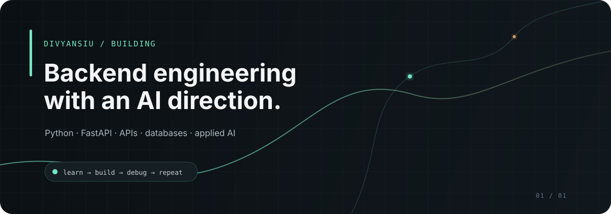

 

**B.Tech CSE student · Backend Engineering · Applied AI**

I learn by building, breaking, debugging, and rebuilding — with a current focus on **Python → FastAPI → APIs → databases → AI/LLM integration**.

 

<a href="https://github.com/divyansiu?tab=repositories">Repositories</a>
&nbsp;&nbsp;·&nbsp;&nbsp;
<a href="https://github.com/divyansiu?tab=projects">Projects</a>
&nbsp;&nbsp;·&nbsp;&nbsp;
<a href="https://github.com/divyansiu">GitHub</a>

---

## Current focus

I’m building the fundamentals that sit underneath reliable software:

- **Backend:** Python, FastAPI, REST APIs
- **Data:** MongoDB, SQL
- **Engineering:** Git/GitHub, debugging, deployment
- **Exploration:** AI / LLM integration and automation

My approach is practical: build something small, understand why it works, debug what breaks, then make the next version better.

---

## Stack

### Languages

  

### Backend

  

### Web

  

### Databases & tools

  

**Exploring:** AI / LLM integration · automation · deeper backend architecture

## Connect

---

Building steadily. Learning in public. Improving one system at a time.
